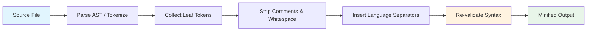

<p align="center">
  <picture>
    <source media="(prefers-color-scheme: dark)" srcset="https://raw.githubusercontent.com/keepkeen/code-minification-skill/main/.github/logo-dark.svg">
    <source media="(prefers-color-scheme: light)" srcset="https://raw.githubusercontent.com/keepkeen/code-minification-skill/main/.github/logo-light.svg">
    
  </picture>
</p>

<h3 align="center">Slim down source code for AI agents — save 20–50% on tokens</h3>

<p align="center">
  <a href="#-quick-start"></a>
  <a href="https://agentskills.io"></a>
  <a href="LICENSE.txt"></a>
  <br>
  <a href="https://github.com/keepkeen/code-minification-skill"></a>
  <a href="README.zh-CN.md"></a>
</p>

---

An [Agent Skill](https://agentskills.io) for **Claude Code**, **Codex**, **opencode**, and compatible AI coding agents. Strips non-semantic whitespace, indentation, and comments from source files — while preserving executable semantics across **13 languages**. Zero external dependencies.

## ✨ Features

- **Zero dependencies** — pure Python stdlib, no `pip install`
- **13 languages** — Python (`tokenize`), Go (ASI), JS/TS, Rust, Java, C/C++, C#, Swift, Ruby, Shell
- **Idempotent** — `minify(minify(x)) == minify(x)`, safe for tool round-trips
- **Syntax validated** — re-parses output, guarantees no syntax errors
- **LLM-verified** — A/B tested with Claude Sonnet 4, no semantic degradation
- **3-phase eval** — built-in `evaluate.py`: reduction, syntax, LLM comprehension

## 🚀 Quick Start

```bash
# Minify a single file
python3 minify_code.py path/to/file.py

# Keep comments
python3 minify_code.py --keep-comments path/to/file.go

# Pipe from stdin
cat file.ts | python3 minify_code.py --language typescript

# JSON output (for automation)
python3 minify_code.py --json path/to/file.rs
```

## 🔧 Installation

**Claude Code** — clone into your skills directory:
```bash
git clone https://github.com/keepkeen/code-minification-skill.git ~/.claude/skills/code-minification
```

**Codex** — install by name:
```bash
$skill-installer https://github.com/keepkeen/code-minification-skill
```

**Standalone** — use it as any Python script:
```bash
git clone https://github.com/keepkeen/code-minification-skill.git
alias minify='python3 /path/to/code-minification-skill/minify_code.py'
```

## 📊 How It Works



**Python** uses stdlib `tokenize` for AST-accurate minification that preserves indentation semantics.  
**Go** uses regex + automatic semicolon insertion (ASI) to stay valid.  
All other languages use regex comment/whitespace stripping with language-specific rules.

## 🌐 Supported Languages

| Extension | Language | Strategy |
|:---|---:|:---|
| `.py` | Python | `tokenize` module — indentation-aware |
| `.js` `.mjs` `.cjs` | JavaScript | Regex comment/whitespace strip |
| `.ts` | TypeScript | Regex comment/whitespace strip |
| `.jsx` `.tsx` | React | Regex — preserves JSX |
| `.go` | Go | Regex + semicolon insertion |
| `.rs` | Rust | Regex comment/whitespace strip |
| `.java` | Java | Regex comment/whitespace strip |
| `.c` `.h` | C | Regex comment/whitespace strip |
| `.cpp` `.hpp` `.cc` | C++ | Regex comment/whitespace strip |
| `.cs` | C# | Regex comment/whitespace strip |
| `.swift` | Swift | Regex comment/whitespace strip |
| `.rb` | Ruby | Regex comment/whitespace strip |
| `.sh` `.bash` | Shell | Collapse blank lines |

## 📈 Evaluation

```mermaid
gantt
    title 3-Phase Evaluation Pipeline
    dateFormat  X
    axisFormat  %s
    
    Phase 1: Reduction Metrics :a1, 0, 1
    Phase 2: Syntax + Idempotency :a2, 1, 1
    Phase 3: LLM Comprehension A/B :a3, 2, 1
```



```
Metric                    Result
──────────────────────────────────────
Average token reduction   17–24%
Syntax validation         100% pass
Idempotency               100% pass
LLM comprehension         Equivalent (A/B w/ Claude Sonnet 4)
```

Run it yourself:

```bash
python3 evaluate.py samples/*.py samples/*.go samples/*.js
```

## ✅ When to Use

- **Exploring a new codebase** — read many files, build mental models faster
- **Large files** (>100 lines) — cut token cost by up to 50%
- **Token budget constrained** — maximize context window usage
- **Cost-sensitive sessions** — fewer tokens = lower API cost

## ⚠️ When NOT to Use

| Scenario | Why It Fails |
|:---|---:|
| 🔴 Compile error debugging | Error line numbers mismatch minified output |
| 🔴 Stack trace analysis | `file:line` references become useless |
| 🔴 `git diff` / code review | Diff vs minified view are misaligned |
| 🔴 Python / YAML minification | Indentation is syntax — `tokenize` handles it, but test first |

See [`SKILL.md`](SKILL.md) for the full risk table and anti-patterns.

## 📁 Project Structure

```
code-minification/
├── SKILL.md              Skill definition (agent-consumable)
├── minify_code.py        Minifier — pure stdlib, 13 languages
├── evaluate.py           3-phase evaluation pipeline
├── README.md             This file
├── README.zh-CN.md       Chinese translation
├── LICENSE.txt           MIT license
└── .gitignore
```

## 📄 License

[MIT](LICENSE.txt) — free to use, modify, and distribute.
