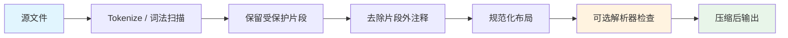

<p align="center">
  <picture>
    <source media="(prefers-color-scheme: dark)" srcset="https://raw.githubusercontent.com/keepkeen/code-minification-skill/main/.github/logo-dark.svg">
    <source media="(prefers-color-scheme: light)" srcset="https://raw.githubusercontent.com/keepkeen/code-minification-skill/main/.github/logo-light.svg">
    
  </picture>
</p>

<h3 align="center">压缩源代码，为 AI 编程助手的探索阶段节省 Token</h3>

<p align="center">
  <a href="#-快速开始"></a>
  <a href="https://agentskills.io"></a>
  <a href="LICENSE.txt"></a>
  <br>
  <a href="https://github.com/keepkeen/code-minification-skill"></a>
  <a href="README.md"></a>
</p>

---

一个符合 [Agent Skills](https://agentskills.io) 标准的技能包，适用于 **Claude Code**、**Codex**、**opencode** 等 AI 编程助手。它在只读探索阶段去除源文件中的注释和格式噪声，同时保留字符串、原始字符串、模板字符串和常见正则字面量。纯 Python 标准库，零外部依赖。

## ✨ 特性

- **零依赖** — 纯 Python 标准库，无需 `pip install`
- **13 种语言** — Python（`tokenize` 模块）、JS/TS、Go、Rust、Java、C/C++、C#、Swift、Ruby、Shell
- **幂等性** — 两次压缩结果一致，安全用于工具链往返
- **可用时做语法检查** — 支持 Python、Go、JS、Rust、Java、C/C++、Swift、Ruby、Shell 的本地解析器检查
- **词法安全** — 保留受保护字面量里的注释标记
- **三阶段评估** — 内置 `evaluate.py`：压缩率、语法验证、LLM 理解力

## 🚀 快速开始

```bash
# 压缩单个文件
python3 minify_code.py path/to/file.py

# 保留注释
python3 minify_code.py --keep-comments path/to/file.go

# 从标准输入读取
cat file.ts | python3 minify_code.py --language typescript

# JSON 格式输出（用于程序化调用）
python3 minify_code.py --json path/to/file.rs
```

## 🔧 安装

**Claude Code** — 克隆到技能目录：
```bash
git clone https://github.com/keepkeen/code-minification-skill.git ~/.claude/skills/code-minification
```

**Codex** — 按名称安装：
```bash
$skill-installer https://github.com/keepkeen/code-minification-skill
```

**独立使用** — 当作普通 Python 脚本使用：
```bash
git clone https://github.com/keepkeen/code-minification-skill.git
alias minify='python3 /path/to/code-minification-skill/minify_code.py'
```

## 📊 工作原理



**Python** 使用标准库 `tokenize`，保留缩进语义。  
**C 风格语言** 使用单遍词法扫描，而不是直接用正则删除注释。  
**评估工具** 会在本地解析器可用时检查语法，不支持的解析器会标记为跳过。

## 🌐 支持的语言

| 扩展名 | 语言 | 策略 |
|:---|---:|:---|
| `.py` | Python | `tokenize` 模块 — 保留缩进语义 |
| `.js` `.mjs` `.cjs` | JavaScript | 词法去除注释 |
| `.ts` | TypeScript | 词法去除注释 |
| `.jsx` `.tsx` | React | 词法去除注释 |
| `.go` | Go | 词法去除注释，保留换行 |
| `.rs` | Rust | 词法去除注释，识别原始字符串和嵌套注释 |
| `.java` | Java | 词法去除注释 |
| `.c` `.h` | C | 词法去除注释 |
| `.cpp` `.hpp` `.cc` | C++ | 词法去除注释，识别原始字符串 |
| `.cs` | C# | 词法去除注释 |
| `.swift` | Swift | 词法去除注释，识别多行字符串和嵌套注释 |
| `.rb` | Ruby | 词法去除 `#` 注释 |
| `.sh` `.bash` | Shell | 合并空行 |

## 📈 评估结果

```mermaid
gantt
    title 三阶段评估流程
    dateFormat  X
    axisFormat  %s
    
    Phase 1: 压缩率统计 :a1, 0, 1
    Phase 2: 语法 + 幂等性 :a2, 1, 1
    Phase 3: LLM 理解力 A/B :a3, 2, 1
```



```
指标                      结果
──────────────────────────────────────
平均 Token 压缩率         通常约 10–35%
语法验证                  可检查的解析器通过，其他跳过
幂等性                    预期通过，建议用 evaluate.py 验证
LLM 理解力                最适合只读探索
```

自行运行评估：

```bash
python3 evaluate.py samples/*.py samples/*.go samples/*.js
```

## ✅ 何时使用

- **探索新代码库** — 批量读取文件，快速建立心智模型
- **大文件**（>100 行）— 最多节省 50% Token 费用
- **Token 预算紧张** — 最大化上下文窗口利用率
- **成本敏感场景** — 更少 Token = 更低 API 费用

## ⚠️ 何时不要使用

| 场景 | 原因 |
|:---|---:|
| 🔴 编译错误调试 | 错误行号与压缩后文件不匹配 |
| 🔴 堆栈跟踪分析 | `file:line` 引用失去意义 |
| 🔴 `git diff` / 代码审查 | Diff 输出与压缩视图不对齐 |
| 🔴 不支持的配置/DSL 文件 | JSON/YAML/TOML/DSL 往往需要精确格式或行号 |

完整风险表和反模式见 [`SKILL.md`](SKILL.md)。

## 📁 项目结构

```
code-minification/
├── SKILL.md              技能定义（供 AI 消费）
├── minify_code.py        压缩器 — 纯标准库，13 种语言
├── evaluate.py           三阶段评估流水线
├── test_minify_code.py   词法边界回归测试
├── README.md             英文自述文件
├── README.zh-CN.md       中文自述文件
├── LICENSE.txt           MIT 许可证
└── .gitignore
```

## 📄 许可证

[MIT](LICENSE.txt) — 自由使用、修改和分发。
