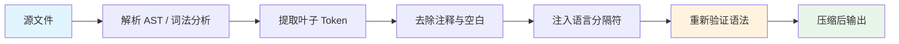

<p align="center">
  <picture>
    <source media="(prefers-color-scheme: dark)" srcset="https://raw.githubusercontent.com/keepkeen/code-minification-skill/main/.github/logo-dark.svg">
    <source media="(prefers-color-scheme: light)" srcset="https://raw.githubusercontent.com/keepkeen/code-minification-skill/main/.github/logo-light.svg">
    
  </picture>
</p>

<h3 align="center">压缩源代码，为 AI 编程助手节省 20–50% Token</h3>

<p align="center">
  <a href="#-快速开始"></a>
  <a href="https://agentskills.io"></a>
  <a href="LICENSE.txt"></a>
  <br>
  <a href="https://github.com/keepkeen/code-minification-skill"></a>
  <a href="README.md"></a>
</p>

---

一个符合 [Agent Skills](https://agentskills.io) 标准的技能包，适用于 **Claude Code**、**Codex**、**opencode** 等 AI 编程助手。去除源文件中的非语义空白、缩进和注释，同时保证 **13 种语言**的可执行语义不变。纯 Python 标准库，零外部依赖。

## ✨ 特性

- **零依赖** — 纯 Python 标准库，无需 `pip install`
- **13 种语言** — Python（`tokenize` 模块）、Go（自动分号插入）、JS/TS、Rust、Java、C/C++、C#、Swift、Ruby、Shell
- **幂等性** — 两次压缩结果一致，安全用于工具链往返
- **语法验证** — 输出被重新解析，保证无语法错误
- **LLM 验证** — 与 Claude Sonnet 4 进行 A/B 测试，确认语义无损
- **三阶段评估** — 内置 `evaluate.py`：压缩率、语法验证、LLM 理解力

## 🚀 快速开始

```bash
# 压缩单个文件
python3 minify_code.py path/to/file.py

# 保留注释
python3 minify_code.py --keep-comments path/to/file.go

# 从标准输入读取
cat file.ts | python3 minify_code.py --language typescript

# JSON 格式输出（用于程序化调用）
python3 minify_code.py --json path/to/file.rs
```

## 🔧 安装

**Claude Code** — 克隆到技能目录：
```bash
git clone https://github.com/keepkeen/code-minification-skill.git ~/.claude/skills/code-minification
```

**Codex** — 按名称安装：
```bash
$skill-installer https://github.com/keepkeen/code-minification-skill
```

**独立使用** — 当作普通 Python 脚本使用：
```bash
git clone https://github.com/keepkeen/code-minification-skill.git
alias minify='python3 /path/to/code-minification-skill/minify_code.py'
```

## 📊 工作原理



**Python** 使用标准库 `tokenize` 进行 AST 级别的精确压缩，保留缩进语义。  
**Go** 使用正则 + 自动分号插入（ASI）保持语法正确。  
其他语言使用正则表达式去除注释和空白，配合语言特定规则。

## 🌐 支持的语言

| 扩展名 | 语言 | 策略 |
|:---|---:|:---|
| `.py` | Python | `tokenize` 模块 — 保留缩进语义 |
| `.js` `.mjs` `.cjs` | JavaScript | 正则去除注释/空白 |
| `.ts` | TypeScript | 正则去除注释/空白 |
| `.jsx` `.tsx` | React | 正则 — 保留 JSX |
| `.go` | Go | 正则 + 自动分号插入 |
| `.rs` | Rust | 正则去除注释/空白 |
| `.java` | Java | 正则去除注释/空白 |
| `.c` `.h` | C | 正则去除注释/空白 |
| `.cpp` `.hpp` `.cc` | C++ | 正则去除注释/空白 |
| `.cs` | C# | 正则去除注释/空白 |
| `.swift` | Swift | 正则去除注释/空白 |
| `.rb` | Ruby | 正则去除注释/空白 |
| `.sh` `.bash` | Shell | 合并空行 |

## 📈 评估结果

```mermaid
gantt
    title 三阶段评估流程
    dateFormat  X
    axisFormat  %s
    
    Phase 1: 压缩率统计 :a1, 0, 1
    Phase 2: 语法 + 幂等性 :a2, 1, 1
    Phase 3: LLM 理解力 A/B :a3, 2, 1
```



```
指标                      结果
──────────────────────────────────────
平均 Token 压缩率         17–24%
语法验证                  100% 通过
幂等性                    100% 通过
LLM 理解力                等效（与 Claude Sonnet 4 A/B 测试）
```

自行运行评估：

```bash
python3 evaluate.py samples/*.py samples/*.go samples/*.js
```

## ✅ 何时使用

- **探索新代码库** — 批量读取文件，快速建立心智模型
- **大文件**（>100 行）— 最多节省 50% Token 费用
- **Token 预算紧张** — 最大化上下文窗口利用率
- **成本敏感场景** — 更少 Token = 更低 API 费用

## ⚠️ 何时不要使用

| 场景 | 原因 |
|:---|---:|
| 🔴 编译错误调试 | 错误行号与压缩后文件不匹配 |
| 🔴 堆栈跟踪分析 | `file:line` 引用失去意义 |
| 🔴 `git diff` / 代码审查 | Diff 输出与压缩视图不对齐 |
| 🔴 Python / YAML 压缩 | 缩进即语法 — `tokenize` 可处理，但建议先测试 |

完整风险表和反模式见 [`SKILL.md`](SKILL.md)。

## 📁 项目结构

```
code-minification/
├── SKILL.md              技能定义（供 AI 消费）
├── minify_code.py        压缩器 — 纯标准库，13 种语言
├── evaluate.py           三阶段评估流水线
├── README.md             英文自述文件
├── README.zh-CN.md       中文自述文件
├── LICENSE.txt           MIT 许可证
└── .gitignore
```

## 📄 许可证

[MIT](LICENSE.txt) — 自由使用、修改和分发。
